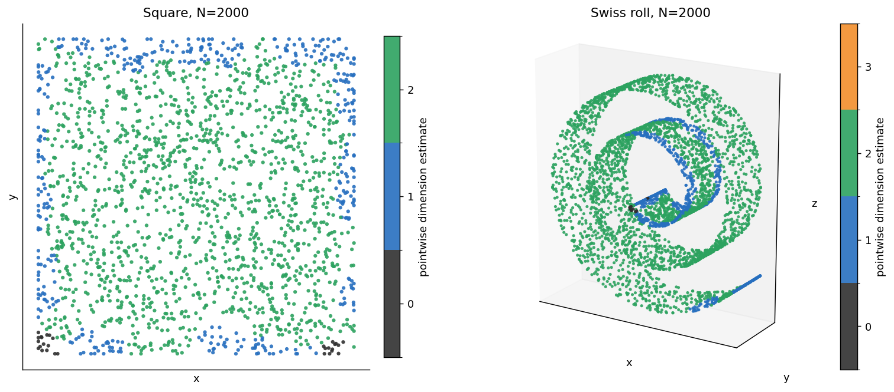
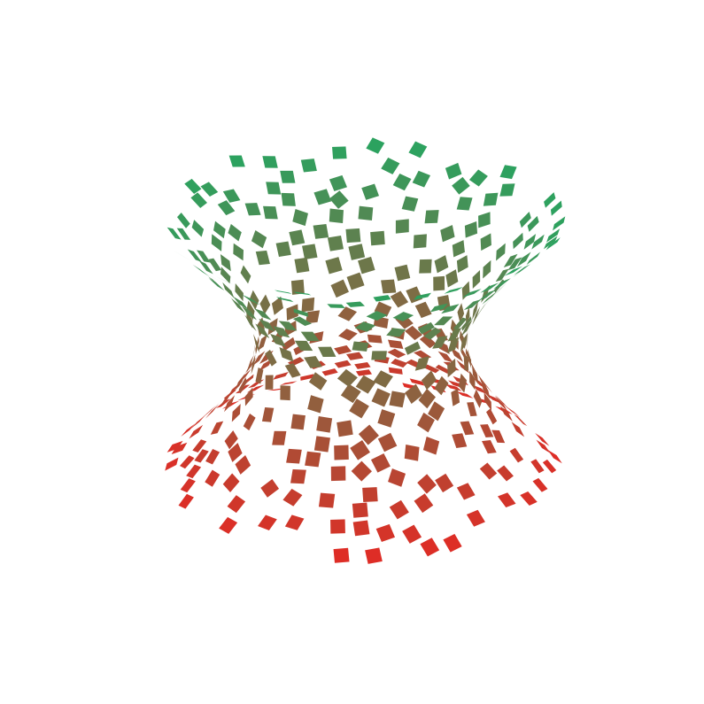
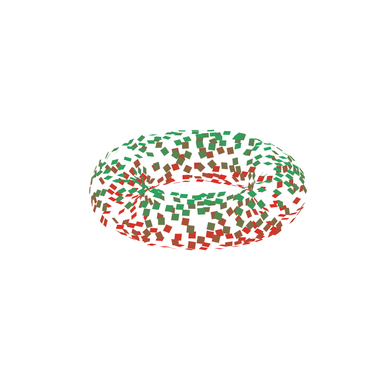

# The Graph Laplacian and the Continuous Laplace Operator

Implementation/simplified account of the [manifold diffusion geometry](https://arxiv.org/abs/2411.04100) method.

We construct a normalized graph Laplacian that acts as a discrete approximation of the continuous Laplace operator on the data manifold. From this we may recover geometric information about the data manifold, such as the dimension and tangent spaces. 

### Method

We construct the normalized graph Laplacian using a [variable bandwidth diffusion kernel](https://arxiv.org/abs/1406.5064). Then using the Laplacian product rule 

$$\Delta fg = f\Delta g + g \Delta f - 2\langle \nabla f, \nabla g\rangle_M$$

we may write the Riemannian metric $\langle\cdot, \cdot \rangle_M$ in terms of the Laplacian as 

$$\langle \nabla f, \nabla g\rangle_M =\tfrac{1}{2}\bigl(-\Delta(fg) + f\Delta g + g\Delta f\bigr)$$

Now we may substitute our graph Laplacian for the continuous Laplace operator $\Delta$ in the above expression to compute the metric at each point, which allows us to recover geometric information. 

See `graph_laplacian_report.pdf` for background and more details.

### Files

* `laplace.py` contains the implementation of the normalized graph Laplacian, the pointwise dimension estimation, and the tangent space estimation.
* `laplace.ipynb` is the notebook that runs the experiments and plots the results.
* `graph_laplacian_report.pdf` is the technical report that contains the mathematical background and details.
* `slides.pdf` are the presentation slides.
* `visualizations.py` has the plotting functions.

### Running

Running the notebook outputs the pointwise dimension and tangent space estimates given by our implementation in `laplace.py`. We sample synthetic data from a few low-dimensional shapes, such as a square in the plane and a torus in 3-space.

To install dependencies and run, use the commands

```
pip install -r requirements.txt
jupyter notebook laplace.ipynb
```

### Results

Below we plot the result of the pointwise dimension estimate on two 2-dimensional manifolds with both one and zero-dimensional boundary components, and the tangent space estimates for a torus and a hyperboloid. We compute the basis for the tangent space at each point and then plot a small segment of the plane they span.






### Limitations

Due to the nature of higher dimensions ("curse of dimensionality"), we would require exponentially more samples to obtain good approximations if the data were higher-dimensional. Thus, our experiments use synthetic data generated from low-dimensional manifolds to illustrate the methods. Additionally, this allows us to easily visualize the results.
